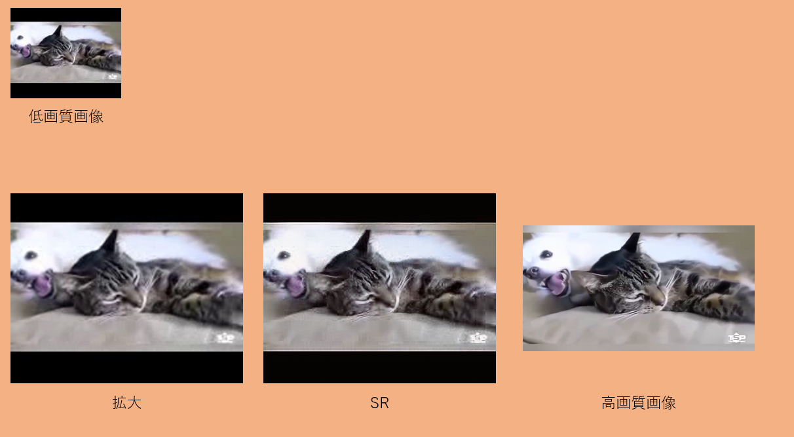

# SRGAN_movie_sr
SRGANを用いて動画を高解像度化する.

## 手順
+ 連番画像の作成
+ 学習済みモデルの配置
+ 画像の高画質化
+ 画像の連結

### 連番画像の作成
ffmpegを<a href="https://www.ffmpeg.org/download.html">ココ</a>からダウンロードする.
ffmpegで動画から連番画像を作成する.
.3gppファイルを高画質化したい場合を例にする.(mp4とかでも出来る.)
```sh
$ mkdir images
$ ffmpeg -i input.3gpp -vcodec png images/image_%06d.png
```

### 学習済みモデルの配置
SRGANのモデルは<a href="https://github.com/tensorlayer/srgan">ココ</a>のものを用いる.
学習済みのデータは<a href="https://data.vision.ee.ethz.ch/cvl/DIV2K/">コレ</a>を用いた.
checkpointはいずれGoogleDriveなどで公開すると思う.
```sh
$ git clone https://github.com/tensorlayer/srgan.git
$ git clone https://github.com/elasticnet12345/srgan_movie_sr.git
$ mkdir srgan/data_3gpp
$ mv images srgan/data_3gpp
# $ python srgan/main.py
$ mkdir srgan/checkpoint
$ mkdir samples_movie
$ mv srgan_movie_sr/checkpoint/* srgan/checkpoint/
$ mv srgan_movie_sr/*.py srgan/
```
### 画像の高画質化
作成した連番画像の番号1~nをrangeの値に設定する.
```sh
$ pyenv global 2.7.11
$ python srgan_meta.py
```
単に一枚の画像のみを生成したい場合は, 以下のようにし出力はsamples_movie/evaluate/valid_gen.pngとして生成される.
```sh
$ python srgan_main.py --model=evaluate --valid_lr_img=image_000001.png
```
<br>
<br>
<br>
<br>
<br>

### 画像の連結
```sh
$ ffmpeg -r 30 -i images/image_%06d.png -vcodec libx264 -pix_fmt yuv420p -r 60 out.mp4
```

